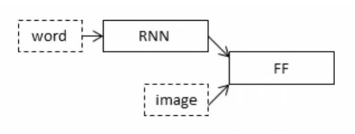
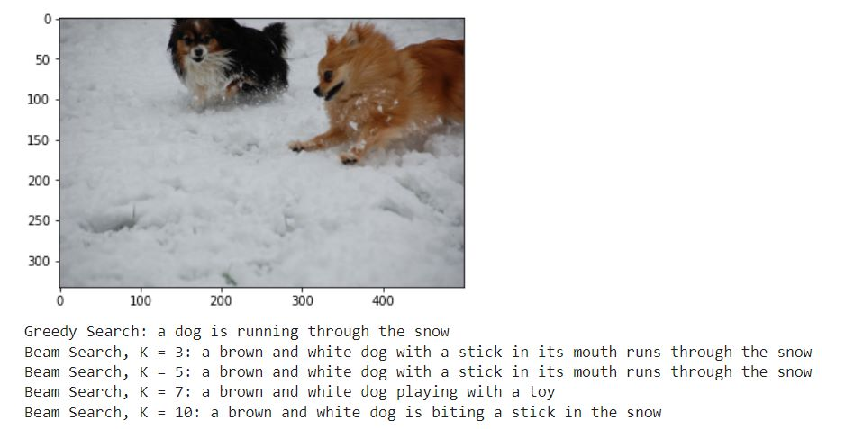
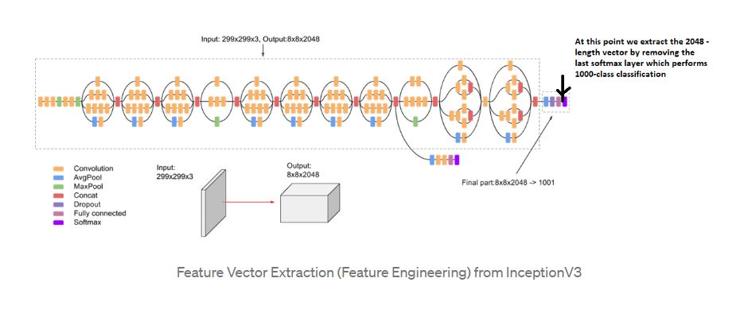
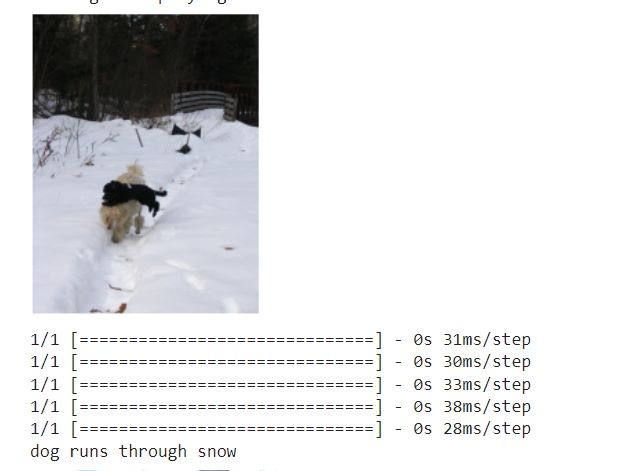

# ImageCaptionGenerator
**Team: Chhavi Jindal, Prachi Agarwal, Shreya Gupta** <br>

[](https://www.python.org/)

The goal of this project is to recognize the **context of an image** and annotating it with relevant captions using **deep learning, and computer vision.**
<br>
- It includes the labeling of an image with English keywords with the help of datasets provided during model training.


## How to run the code
[](https://svgshare.com/i/Zhy.svg) [](https://svgshare.com/i/ZjP.svg) [](https://svgshare.com/i/ZhY.svg)
- Make a **data** folder and download the following data set : 
<code><a href="https://github.com/jbrownlee/Datasets/releases/download/Flickr8k/Flickr8k_Dataset.zip">Flicker8k_Dataset </a></code> &nbsp;
<code><a href="https://github.com/jbrownlee/Datasets/releases/download/Flickr8k/Flickr8k_text.zip">Flickr_8k_text </a></code>
- Rename the folder into **data**
- Make a **Glove** folder and dwonload the following links : <code><a href="https://www.kaggle.com/datasets/watts2/glove6b50dtxt">glove6b50dtxt </a></code> &nbsp;
<code><a href="https://www.kaggle.com/datasets/incorpes/glove6b200d">glove6b200d </a></code>
- Rename the folder into **GloVE**

## Python supported versions
The code is ready to run for every version of python greater than 3.6.
As you will see also in the code, some facilities are not available in python versions lower than 3.9.

## Prerequisites
- NLP
- CNN
- RNN
- Language model
- Word embeddings
- Transfer Learning

## How this model works
**Example:** <br>


caption generated for this image is:
```
a plane is flying in blue sky.
``` 
## Project Overview
- Our project converts a computer program that takes an image as input and produces a relevant caption as output
<p align="center"></p>

- We have used the **Flickr 8k dataset**
- This dataset contains 8000 images each with 5 captions
- These images are bifurcated as follows: <br>
Training Set — 6000 images <br>
Dev Set — 1000 images <br>
Test Set — 1000 images <br>

## We have used 2 models: <br>
<ins>**First model4.ipynb uses:**
- InceptionV3
- Keras
- matplotlib
- LSTM
- glob
- Dense
- Greedy and Beam Search
<br>

<p align="center"></p>

We have used an **Encoder-Decoder** model. Here our encoder model will combine both the encoded form of
the image and the encoded form of the text caption and feed to the decoder.
<br>

Our model will treat **CNN as the ‘image model’** and the **RNN/LSTM as the ‘language model’** to encode the text sequences of
varying length. The vectors resulting from both the encodings are then merged and processed by a Dense layer to make a final prediction.
<br>

To encode our image features, we will make use of transfer learning.
<br>

We have used the **inceptionV3 model.**
<br>

To encode our text sequence we will map every word to a **200-dimensional vector.** For this will use a pre-trained Glove model.
To generate the caption, we will be using two popular methods which are **Greedy Search and Beam Search.**
<br>

**Example:**
<p align="center"></p>

<br>

<ins>**Second model5.ipynb uses:** <br>
- ResNet50
- Keras
- Numpy
- matplotlib
- time
- tickle
- Dense
- LSTM
- collections
<p align="center"></p>

To encode our image features, we will make use of transfer learning
<br> 

We have used the **ResNet50 model**
<br>

To encode our text sequence, we will map every word to a **50-dimensional vector.** For this will use a pre-trained Glove model.
<br>

**Example:**
<p align="center"></p>

